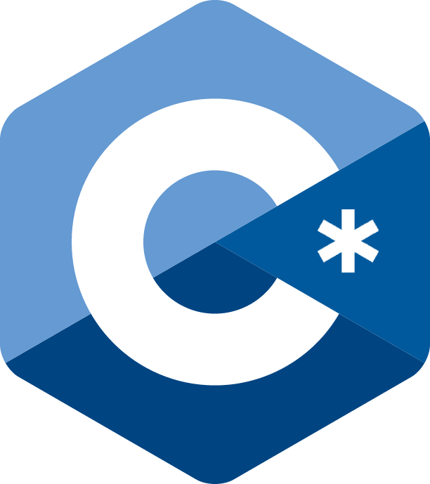

<p align="center">
  
  
  <a href="LICENSE">
    
  </a>
</p>

<p align="center">
  
</p>
<p align="center"><i>A compiled language built from the ground up by Oliver Poole.</i></p>

---

## 📖 What is a Compiled Language?

A **compiled language** is a programming language where source code is translated into machine code **before** it is executed. This is done by a program called a **compiler**.

Unlike interpreted languages (like Python), which are translated line-by-line at runtime, compiled languages produce a standalone executable that can be run directly by the operating system — with no interpreter needed.

**Advantages of compiled languages:**
- ⚡ Faster execution — machine code runs directly on the CPU
- 🔒 Errors are caught at compile time, before the program ever runs
- 📦 Produces a portable executable — no runtime dependency needed
- 🔧 More control over memory and system resources

---

## ⚙️ How the C* Compiler Works

The C* compiler takes your source code through several stages to produce a runnable executable:

```
Source Code (.cst)
        │
        ▼
  ┌───────────┐
  │  Lexer    │  → Breaks source into tokens (keywords, operators, literals)
  └───────────┘
        │
        ▼
  ┌───────────┐
  │  Parser   │  → Builds an Abstract Syntax Tree (AST) from tokens
  └───────────┘
        │
        ▼
  ┌───────────────────┐
  │  Code Generation  │  → Outputs machine code/assembly code
  └───────────────────┘
        │
        ▼
   Executable Binary
```

1. **Lexing** — The raw source text is scanned and broken into meaningful tokens like `var`, `exit`, `+`, numbers, and identifiers.
2. **Parsing** — Tokens are arranged into an AST that represents the structure and meaning of your program.
3. **Semantic Analysis** — The compiler verifies that the code makes logical sense: variables are declared before use, types are valid, etc.
4. **Code Generation** — The AST is translated into low-level machine instructions that the CPU can execute directly.

---

## ✅ Current Features

### Variables
Declare and assign variables using `var`:
```cst
var x = 10; // int var 'x' with value 10
var name = 42; // int var 'name' with value 42
```

Reassign a variable after declaration:
```cst
x = 20; // reassign var 'x' with value 20
```

---

### Arithmetic Operators
C* supports the four fundamental arithmetic operations:

| Operator | Description    | Example      |
|----------|----------------|--------------|
| `+`      | Addition       | `x + y`      |
| `-`      | Subtraction    | `x - y`      |
| `*`      | Multiplication | `x * y`      |
| `/`      | Division       | `x / y`      |


---

### Exit
Terminate a program with a specific exit code using `exit()`:
```cst
exit(0); // Success
exit(1); // Error
```

The exit code is returned to the operating system and can be used to signal success or failure to other programs or scripts.

---

### Functions
You can declare functions in cst like this:
```cst
// creates add() function with args (x, y)
int add(int x, int y) {
    return x + y; // return x + y
}
```

You can call created functions in cst like this:
```cst
int sum = add(1, 8); // returns 1 + 8 (9)
int sum = add(4, 2); // returns 4 + 2 (6)
```

---

## 🚀 Getting Started

> *Installation and usage instructions coming soon.*

---

## 📄 License

This project is licensed under the MIT License.
